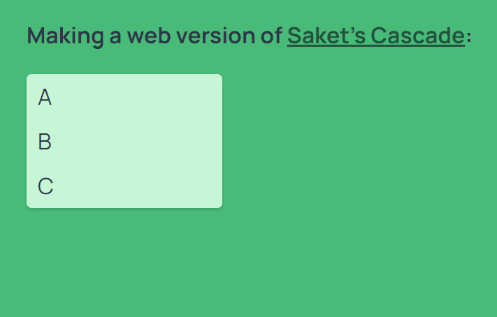

# Cascade in React

It basically lets you do this:

## Install

This project uses `npm` to install its dependencies. Use `npm i` in terminal/command line to install them.

## Develop

Development server can be started using `npm start`.

## Build

Production build can be done using `npm run build`. Build files will be created in `build/` folder.

## Other commands

- `npm run lint` – Lints code using ESLint
- `npm run format` – Formats code using Prettier
- `npm run analyze` – Shows bundle (production build) size breakdown
